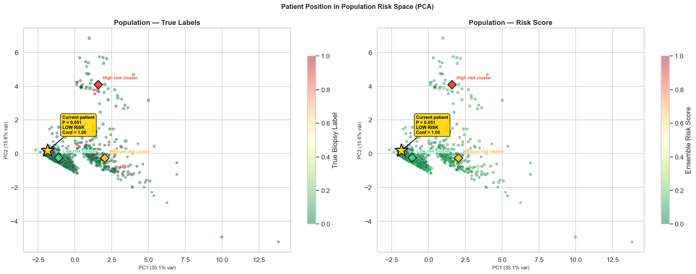
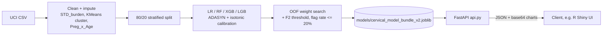

# CxRisk: Cervical Cancer Risk Ensemble + FastAPI Service

A calibrated four-model ensemble that flags patients for biopsy follow-up from screening-visit risk factors, served over a FastAPI endpoint that returns a probability, a confidence score, a plain-language explanation and three explanation charts.

 



## What it does

- Predicts `Biopsy` on the UCI cervical cancer risk-factor cohort (858 patients, 6.4% positive) from 9 screening-time features, with prior HPV/cancer diagnoses deliberately left out as leakage.
- Ensembles Logistic Regression, Random Forest, XGBoost and LightGBM, each with ADASYN resampling and isotonic calibration; soft-vote weights are found by Nelder-Mead on out-of-fold PR-AUC (RF ends up at 0.75, XGB at 0.008).
- Picks the decision threshold (0.096) by maximizing F2 subject to flagging at most 20% of patients, down from an 81% flag rate in the first version.
- Scores a locked 20% stratified holdout once: ROC-AUC 0.7685, PR-AUC 0.1772.
- Serves `/predict`, `/health` and `/schema` with Pydantic validation; each prediction includes a six-term confidence score, per-model probabilities, clinical warnings and base64 PNG charts rendered server-side.

## Architecture



`scripts/train.py` (or `notebooks/02_model_v2.ipynb`) builds a single joblib bundle holding the calibrated models, ensemble weights, threshold, confidence-score weights, KMeans and PCA transforms, and the population coordinates used for the scatter chart. `api.py` loads that bundle once at startup, so no training code runs on the request path. The client sends seven raw fields; the service derives the risk cluster and the pregnancy-age interaction itself. An R Shiny clinician frontend (teammate-built, not included here) consumed this API.

## Quickstart

```bash
git clone https://github.com/DevSoVague/cxrisk-cervical-dss.git
cd cxrisk-cervical-dss
python3.10 -m venv .venv && source .venv/bin/activate
pip install -r requirements.txt
# macOS only: XGBoost and LightGBM need OpenMP -> brew install libomp

python scripts/train.py            # ~40 s, writes models/cervical_model_bundle_v2.joblib
uvicorn api:app --port 8001        # interactive docs at http://localhost:8001/docs
```

Optional environment variable: `CXRISK_BUNDLE_PATH` (path to the trained model bundle; defaults to `models/cervical_model_bundle_v2.joblib`). No other environment variables or secrets are needed.

Example request:

```bash
curl -X POST http://localhost:8001/predict \
  -H "Content-Type: application/json" \
  -d '{"age": 32, "sexual_partners": 3, "pregnancies": 2,
       "smokes_years": 0, "hc_years": 4, "iud_years": 0, "std_burden": 1}'
```

Response (charts truncated):

```json
{
  "prediction": "LOW RISK",
  "probability": 0.0814,
  "threshold": 0.0963,
  "confidence": 1.0,
  "confidence_tier": "High confidence",
  "model_probs": {"LR": 0.0912, "RF": 0.082, "XGB": 0.064, "LGB": 0.0623},
  "ensemble_weights": {"LR": 0.1518, "RF": 0.7474, "XGB": 0.0081, "LGB": 0.0928},
  "warnings": [],
  "nl_explanation": "The model predicts low risk with an ensemble probability of 8.1% ...",
  "scatter_png_b64": "iVBORw0...", "waterfall_png_b64": "...", "contribution_png_b64": "..."
}
```

`age`, `sexual_partners` and `pregnancies` are required; the rest default to 0, and `cluster` is inferred if omitted. Out-of-range input (for example `age` under 10) returns 422. Full endpoint and field reference: [docs/API.md](docs/API.md).

## Data

The public [UCI Cervical Cancer (Risk Factors)](https://archive.ics.uci.edu/dataset/383/cervical+cancer+risk+factors) dataset (CC BY 4.0) is included unmodified at `data/risk_factors_cervical_cancer.csv`, with citation in [data/README.md](data/README.md). It is de-identified public data; no other data is used. The trained bundle is not committed (it is about 12 MB and is rebuilt by `scripts/train.py`).

## Results

All tuning used out-of-fold predictions on the 80% training split; the 20% holdout (172 patients, 11 positive) was scored once.

| Metric | Value |
|---|---|
| Holdout ROC-AUC | 0.7685 |
| Holdout PR-AUC (base rate 0.064) | 0.1772 |
| Holdout F2 at threshold 0.096 | 0.1613 |
| Holdout flag rate | 10.5% |
| Holdout recall / precision on Biopsy=1 | 0.18 / 0.11 |
| Ensemble OOF ROC-AUC / PR-AUC (train) | 0.5836 / 0.1031 |
| RF with prior Dx features, holdout ROC-AUC (comparison only) | 0.7143 |

The holdout has only 11 positives, so these numbers are noisy, and the gap between OOF and holdout AUC is worth keeping in mind. `scripts/train.py` reproduces the table and the published bundle metadata exactly with the pinned versions in `requirements.txt` (scikit-learn 1.7.2, imbalanced-learn 0.14.1, XGBoost 3.2.0, LightGBM 4.6.0); newer library versions run but give different numbers. Plots are in [assets/model_plots_v2/](assets/model_plots_v2/), and `notebooks/02_model_v2.ipynb` keeps its outputs (SHAP, calibration, subgroup AUC, threshold sweep).

This is a course project on a small single-site dataset, not a validated clinical tool.

## Project structure

```
cxrisk-cervical-dss/
├── api.py                    FastAPI service (/predict, /health, /schema)
├── scripts/train.py          Minimal training path, writes the model bundle
├── notebooks/
│   ├── eda_v2.ipynb          EDA, cleaning, K-Means risk clusters
│   ├── 02_model_v2.ipynb     Full modelling notebook (outputs kept)
│   └── cervical_cancer_model_sensitivity.ipynb   Sensitivity / what-if analysis (v1 model)
├── data/                     UCI CSV + citation
├── models/                   Bundle metadata JSON (bundle itself is built locally)
├── assets/model_plots_v2/    Evaluation and explanation plots
├── docs/
│   ├── API.md                Endpoint and field reference
│   └── model_readme.md       Original long-form course write-up
└── requirements.txt
```

## Team & credits

Healthcare Information Systems, Carnegie Mellon University (Spring 2026), Group 6: Esha Pandya, Devavrath Sandeep, Abigail Torbatian.

- Devavrath Sandeep: EDA, modelling pipeline, sensitivity analysis and the FastAPI service (this repository).
- Teammates: problem specification, process models, database design and the R Shiny clinician frontend (not included here).

## License

MIT, see [LICENSE](LICENSE). The dataset is CC BY 4.0 from the UCI Machine Learning Repository.
