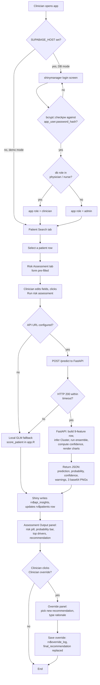

# CxRisk Assessment Workflow

What happens, in order, when a clinician opens the app and runs a cervical cancer risk assessment on one patient: login, patient selection, assessment, API scoring, display, optional override. The population dashboard and the offline training pipeline (`scripts/train.py`, `notebooks/02_model_v2.ipynb`) are separate subsystems and are not covered here.

Source: [frontend/app.R](../frontend/app.R) (R Shiny frontend) and [api.py](../api.py) (FastAPI backend). The API loads `models/cervical_model_bundle_v2.joblib` at startup. All runtime configuration comes from environment variables (listed at the end).

---

## Two run modes

| | Demo mode | DB mode |
|---|---|---|
| Selected when | `SUPABASE_HOST` is unset | `SUPABASE_HOST` is set |
| Login | none | shinymanager screen, bcrypt check against `app_user` |
| Patients | 60 synthetic "Demo Patient NNN" records built from the public UCI CSV | `patient` / `encounter` / `risk_assessment` / `dss_recommendation` tables ([frontend/schema.sql](../frontend/schema.sql)) |
| New patients | appended in memory for the session | inserted into the four tables |
| Scoring API | `CERVICAL_API_URL`, default `http://localhost:8001/predict` | only if `CERVICAL_API_URL` is set |
| Fallback | local logistic model in app.R | same |

Everything below applies to both modes unless it mentions the database.

---

## The most common path



---

## What happens at each step

1. **Startup.** app.R reads `data/risk_factors_cervical_cancer.csv` (missing values coded `?`), drops exact duplicate rows, and median-imputes a copy. The imputed copy fits the local fallback GLM; the cleaned copy feeds the dashboard's "any abnormal outcome" tile and, in demo mode, the synthetic patient list.
2. **Login (DB mode only).** `check_db_credentials` queries `app_user` for a matching email where `is_active = TRUE` and verifies the submitted password with `bcrypt::checkpw` against `password_hash`, which must therefore hold a bcrypt hash. The database role is mapped to an app role: `physician` and `nurse` become `clinician`; anything else becomes `admin`.
3. **Patient list.** In DB mode `load_patients_from_db` runs one joined SELECT over `patient`, `encounter`, `risk_assessment` and `dss_recommendation`. In demo mode `build_demo_patients` samples 60 rows from the UCI table and attaches synthetic identities. Any row without `predicted_probability` or `risk_level` is back-filled once at startup by the local GLM (`score_patient`), so the search table always shows a score.
4. **Patient selection.** *Open selected patient* sets `rv$selected_patient_id` and switches to the Risk Assessment tab, whose form pre-fills from that row.
5. **Run assessment.** `observeEvent(input$run_assessment)` copies the form fields back into `rv$patients` for the current row, then calls `call_risk_api(row, low_threshold, high_threshold)`.
6. **API decision.** `call_risk_api` always computes the local GLM score first (the fallback) and calls the FastAPI backend only when an API URL is configured. On any non-200 status, timeout or exception, the local score is returned and `api_status` says why.
7. **FastAPI `/predict`.** The backend runs, in order:
   1. `build_feature_row` assembles the nine-column frame in `FEATURE_NAMES` order, computes `Preg_x_Age = pregnancies x age`, and infers `Cluster` from the saved KMeans model if not supplied.
   2. `predict_ensemble` gets `predict_proba(...)[:, 1]` from each model and combines them with `ENS_WEIGHTS`.
   3. `pred_class = int(ens_prob >= THRESHOLD)`, with `THRESHOLD = 0.0963` stored in the bundle (tuned for a flag rate of at most 20%).
   4. `compute_confidence` scales the row with `SCALER_CONF` and evaluates the six-term formula below.
   5. `generate_nl_explanation` builds the plain-language paragraph.
   6. `build_warnings` appends any of three clinical warnings.
   7. Three matplotlib figures are rendered headless and returned as base64 PNGs.
8. **Display.** `rv$api_insights` holds the normalized response. The Assessment Output panel shows the risk pill (`Low`, `Medium`, `High`), the probability bar, the top drivers and the recommended action. The Model Insights tab adds the confidence tier badge, the explanation, the warnings and the three charts.
9. **Override (optional).** *Clinician override* opens a dropdown of the three canonical actions and a free-text rationale. *Save override* replaces `final_recommendation` for the row and appends a row to `rv$override_log` (timestamp, patient id, model recommendation, new recommendation, reason).

---

## Exact configuration and inputs

### The nine features the model consumes

Stored in `BUNDLE["feature_names"]`; `build_feature_row` maps each request into this order:

```
['Age',
 'Number of sexual partners',
 'Num of pregnancies',
 'Smokes (years)',
 'Hormonal Contraceptives (years)',
 'IUD (years)',
 'STD_burden',
 'Cluster',
 'Preg_x_Age']
```

### The seven fields Shiny sends

`build_api_payload` in app.R sends exactly these keys; the API derives the other two:

```r
list(
  age             = ...,
  sexual_partners = ...,
  pregnancies     = ...,
  smokes_years    = ...,
  hc_years        = ...,
  iud_years       = ...,
  std_burden      = ...   # coalesce(stds_number, stds, 0)
)
```

### Ensemble weights (from `models/cervical_model_metadata_v2.json`)

```
LR   0.1518
RF   0.7474
XGB  0.0081
LGB  0.0928
```

Random Forest carries about 75% of the weight; XGBoost's out-of-fold weight is close to zero.

### Threshold and confidence formula

```
Binary decision:    HIGH RISK if ens_prob >= 0.0963 else LOW RISK
Confidence score:   a*x + b*y - c*z + d*m + e*(1 - H) + f*agreement
```

The weights `(a, b, c, d, e, f)` come from `BUNDLE["conf_weights"]` (fit on out-of-fold predictions to separate correct from wrong calls). The terms:

| Term | Meaning |
|---|---|
| `x` | Cosine similarity between the scaled patient vector and the predicted-class centroid |
| `y` | Ensemble probability, oriented toward the prediction |
| `z` | `(1 - ens_prob) x cos_sim(opposite-class centroid)`, the pull toward the other class |
| `m` | Demographic match: closeness of the patient's age to `demo_pos["age_mean"]`, capped at 3 standard deviations |
| `1 - H` | Certainty bonus (1 minus normalized binary entropy of `ens_prob`) |
| `agreement` | Fraction of the four models whose 0.5-thresholded call matches `pred_class` |

Confidence tiers (`confidence_tier` in api.py):

| Score | Tier |
|---|---|
| >= 0.85 | High confidence |
| >= 0.70 | Moderate confidence, consider follow-up |
| >= 0.55 | Low confidence, borderline |
| < 0.55 | Very low confidence, inconclusive |

### The three clinical warning triggers

From `build_warnings` in api.py:

1. **STD under-reporting.** Fires when `std_burden == 0` and `pred_class == 1` and at least one of `age > 40`, `sexual_partners > 4`, `smokes_years > 5`, `hc_years > 5`.
2. **Low model agreement.** Fires when fewer than 60% of the individual models agree with the ensemble decision.
3. **IUD status unknown.** Fires when `iud_years == 0` and `pred_class == 1`, since an unknown IUD status would drop a protective signal and could overstate risk.

### Runtime configuration

Environment variables (names only; set them in your shell or deployment, never in a committed file):

| Variable | Used by | Purpose |
|---|---|---|
| `CXRISK_BUNDLE_PATH` | api.py | Model bundle path, default `models/cervical_model_bundle_v2.joblib` |
| `CERVICAL_API_URL` | app.R | Scoring endpoint; demo mode defaults to `http://localhost:8001/predict` |
| `CERVICAL_API_KEY` | app.R | Optional, sent as a Bearer token |
| `CERVICAL_API_TIMEOUT` | app.R | Seconds, default 10 |
| `SUPABASE_HOST` | app.R | Postgres host; setting it switches to DB mode |
| `SUPABASE_USER`, `SUPABASE_PASSWORD` | app.R | Postgres credentials (DB mode) |
| `SUPABASE_DBNAME`, `SUPABASE_PORT`, `SUPABASE_SSLMODE` | app.R | Optional, defaults `postgres`, `6543`, `require` |
| `CXRISK_DATA_CSV` | app.R | Optional path to the UCI CSV if not run from the repo root |

Assessment-form slider defaults:

```
low_threshold   0.15   (Routine / Expedited)
high_threshold  0.35   (Expedited / Referral)
```

The three canonical override choices:

```
"Routine recall"
"Expedited HPV/Pap testing"
"Referral for further evaluation"
```

---

## Gotchas that only tracing the execution reveals

- **Prior HPV and prior cancer inputs are ignored by the API model.** The form collects `assess_dx_hpv` and `assess_dx_cancer` and writes them into `rv$patients`, but `build_api_payload` never sends them: the v2 model was retrained without the leaky `Dx:` features. They only affect the local GLM fallback.
- **The API never returns "Medium", so the two threshold sliders do nothing when the API succeeds.** The API's `prediction` is `"HIGH RISK"` or `"LOW RISK"`. `normalize_api_response` maps that string to `High` or `Low`; only `score_patient` (the fallback) uses the sliders to split Low / Medium / High.
- **`rv$api_insights` is not cleared when switching patients.** It is only reassigned on *Run risk assessment* (and, in demo mode, on adding a patient). Open patient A, run an assessment, then open patient B without running one, and Model Insights still shows A's results under B's name.
- **The override rationale is not enforced.** `save_override` only requires a selected patient; a blank rationale saves and the audit log gets an empty `reason`.
- **The local fallback uses different features.** The fallback GLM is fit on `available_features`, which includes `dx_cancer`, `dx_cin`, `dx_hpv`, `dx`, `first_sexual_intercourse_age` and `smokes_packs_per_year`, none of which the API model uses. When the API is down, the same patient can change risk category because a different model is scoring it.
- **`Cluster` and `Preg_x_Age` have no UI field.** They are derived inside the API from the other inputs, so the clinician cannot inspect or override them.

---

## What persists and where

| What | Where it lives | When it is written | How to inspect |
|---|---|---|---|
| Patient demographics and risk factors | DB mode: `patient` and `risk_assessment` tables. Demo mode: memory only | On patient add | SQL client; Patient Search tab |
| Model score and recommendation | DB mode: `dss_recommendation`; both modes: `rv$patients` (session) | DB row on patient add; session copy overwritten by *Run risk assessment* | Population Dashboard tiles; SQL |
| Full API response for the current assessment | `rv$api_insights` (session) | Each *Run risk assessment* | Model Insights tab |
| Override events | `rv$override_log` (session) | Each *Save override* | Population Dashboard, *Override activity* table |
| Login session and role | `res_auth` from `shinymanager::secure_server` (DB mode) | On login | `user_role()` reactive |
| API request logs | uvicorn stdout, `dss_api` logger | Each request | Terminal running `uvicorn api:app` |

Overrides and re-scored probabilities are in memory only in both modes; they are not written back to the database. Restarting the app reloads the last database state (or a fresh demo registry) and loses session overrides.
